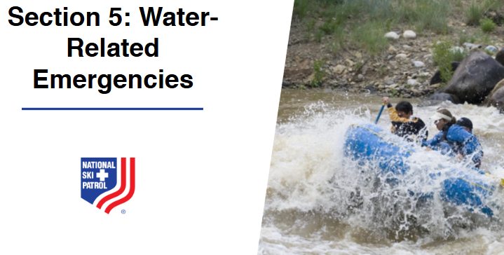

    
# Nsp Oec Training Chapter 29 

## National Ski Patrol - Outdoor Emergency Care chapter 29

    

    

Chapter 29: Water-Related Emergencies

1. Define drowning. 
2. Explain water-related emergencies.
3. Discuss spinal injuries in submersion incidents. 
4. Explain swimmer’s ear, including assessment and care. 
5. Explain how to assess a patient with a water-related emergency.
6. Describe how to manage a patient who has suffered a water-related emergency.
7. List the multiple ways in which a water-based emergency may be prevented. 

## 29.1 Define drowning. 

Drowning is the process of experiencing **respiratory impairment** from submersion or immersion in liquid, leading to difficulty breathing. It can result in **survival with injury**, survival without injury, or **death**. Drowning occurs when water enters the airways, causing the body to struggle for oxygen and potentially leading to asphyxia.

## 29.2 Explain water-related emergencies.

Water-related emergencies include any situations where individuals are at risk of **injury or death due to incidents in or around water**. These emergencies can involve **drowning, near-drowning, hypothermia, and watercraft accidents**, and they often occur in swimming pools, oceans, lakes, rivers, or during activities such as boating and water sports. Common causes include **inability to swim, sudden waves or currents, entanglement, diving accidents, alcohol consumption, and lack of safety equipment**, requiring quick and effective rescue measures and immediate first aid to address potential injuries, breathing issues, or hypothermia.

## 29.3 Discuss spinal injuries in submersion incidents. 

Spinal injuries in submersion incidents typically occur when an individual’s head or neck collides with a hard surface, such as the bottom of a pool, rocks, or a diving board, often due to **diving accidents, falls, or high-impact water sports**. These injuries can result in **fractures, dislocations, or spinal cord damage**, which may lead to paralysis or loss of function, and are especially dangerous because they can cause **immobilization** in the water, increasing the risk of drowning. During rescue, it's crucial to **stabilize the head and neck** and minimize movement to prevent further spinal damage, using techniques like **in-water spinal stabilization** to safely extract the person without worsening the injury.

## 29.4 Explain swimmer’s ear, including assessment and care. 

### **Swimmer’s Ear (Otitis Externa)**:
Swimmer’s ear is an **infection of the outer ear canal**, caused by water that remains trapped in the ear after swimming, creating a moist environment that promotes **bacterial or fungal growth**. It often occurs due to prolonged exposure to water, frequent swimming, or inserting objects (like cotton swabs) into the ear that can damage the ear canal.

### **Assessment**:
- **Symptoms**: Look for **itching in the ear canal**, redness, pain (especially when the outer ear is pulled or pressed), and **discharge** from the ear that may be clear, yellow, or pus-like.
- **Examination**: Gently inspect the outer ear for **swelling or redness**, and ask the patient about symptoms like **reduced hearing, fullness in the ear**, or discomfort that worsens when the ear is touched.

### **Care**:
- **Keep the Ear Dry**: Advise the patient to avoid water exposure (e.g., swimming or showering without ear protection) until the infection clears.
- **Over-the-Counter Ear Drops**: Use **antibacterial or antifungal ear drops** as recommended by a healthcare provider, which may help reduce infection and inflammation.
- **Pain Management**: Over-the-counter **pain relievers** (like acetaminophen or ibuprofen) can be taken to alleviate discomfort.
- **Avoid Inserting Objects**: Do not insert cotton swabs, fingers, or other objects into the ear, as this can aggravate the infection or cause further damage.
- **Seek Medical Attention**: If symptoms **persist or worsen**, or if there is significant pain or fever, see a healthcare provider for a proper diagnosis and prescription treatment.

## 29.5 Explain how to assess a patient with a water-related emergency.

Assessing a patient involved in a water-related emergency involves a systematic approach to quickly determine their condition and address any immediate life-threatening issues. Here’s how to conduct the assessment:

### **1. Ensure Scene Safety**
   - **Check the Environment**: Make sure the area is safe for you and the patient, and remove the patient from the water if it's safe to do so. Use **rescue equipment** if needed to avoid risking your own safety.

### **2. Initial Assessment (Primary Survey)**
   - **Check Responsiveness**: Determine if the patient is **conscious or unresponsive** by calling out to them and gently tapping.
   - **Airway**: Ensure the **airway is open and clear**. If the patient is unresponsive, carefully tilt the head back and lift the chin, but be cautious of possible spinal injuries.
   - **Breathing**: Look, listen, and feel for **normal breathing**. If there is no breathing, or only gasping, **begin rescue breathing** and consider **CPR**.
   - **Circulation**: Check for a **pulse**. If there is no pulse, start **CPR** immediately.

### **3. Check for Signs of Spinal Injury**
   - **Suspect Spinal Injury**: Assume a spinal injury if the patient was **diving, in a high-impact water crash, or found floating face down**, especially if they have bruising, neck pain, or numbness.
   - **Stabilize the Head and Neck**: If a spinal injury is suspected, manually **stabilize the head and neck** in a neutral position and avoid unnecessary movement during rescue.

### **4. Conduct a Detailed Physical Examination (Secondary Survey)**
   - **Check for Injuries**: Look for **cuts, bruises, fractures, and signs of trauma**, including to the head, neck, chest, and extremities.
   - **Look for Symptoms of Hypothermia**: Assess for **cold, pale skin, shivering, or confusion**, which could indicate hypothermia, especially if the patient has been in cold water.
   - **Assess Level of Consciousness**: Use the **AVPU scale** (Alert, Verbal, Pain, Unresponsive) to determine how responsive the patient is.
   - **Check for Signs of Near-Drowning**: Look for **coughing, foaming at the mouth, rapid or labored breathing, and cyanosis (bluish skin color)**, which can indicate water in the lungs or respiratory distress.

### **5. Monitor Vital Signs**
   - **Breathing and Pulse Rate**: Continuously monitor **breathing and pulse**, and be prepared to continue or initiate CPR if the patient stops breathing or loses their pulse.
   - **Temperature**: Monitor for signs of **hypothermia** if the patient has been in cold water.

### **6. Provide Immediate Care and Prepare for Transport**
   - **Begin Resuscitation if Necessary**: Start **rescue breaths, CPR, and defibrillation** (if an AED is available) as needed.
   - **Treat Hypothermia**: If the patient is showing signs of hypothermia, **remove wet clothing**, cover them with **warm blankets**, and avoid rapid warming. 
   - **Prepare for Medical Transport**: Ensure the patient is transported to a medical facility for further evaluation and care, as water-related emergencies may have delayed complications, such as **secondary drowning** or worsening hypothermia.

### Summary:
1. **Ensure Scene Safety**: Make sure the area is safe and remove the patient from the water if possible.
2. **Initial Assessment (Primary Survey)**: Check responsiveness, airway, breathing, and circulation; start CPR if needed.
3. **Check for Spinal Injury**: Stabilize the head and neck if a spinal injury is suspected.
4. **Detailed Physical Examination (Secondary Survey)**: Look for injuries, hypothermia, and symptoms of near-drowning.
5. **Monitor Vital Signs**: Continuously assess breathing, pulse, and temperature.
6. **Provide Care and Prepare for Transport**: Start resuscitation, treat hypothermia, and ensure the patient is taken to a medical facility for further care. 

Quick and thorough assessment can significantly improve outcomes in water-related emergencies by addressing life-threatening issues early and preparing for potential complications.

## 29.6 Describe how to manage a patient who has suffered a water-related emergency.

Managing a patient who has suffered a water-related emergency involves immediate actions to address potential life-threatening conditions, such as drowning, hypothermia, and spinal injuries. Here’s a step-by-step approach:

### **1. Ensure Scene Safety**
   - **Check the Environment**: Make sure the area is safe for you to approach and assist the patient. Use **rescue equipment** if needed and ensure there is no further risk (e.g., strong currents, dangerous marine life).

### **2. Remove the Patient from Water Safely**
   - **Rescue Techniques**: If the patient is in the water, carefully bring them to shore or a safe area. If a spinal injury is suspected, use a **spinal stabilization technique** during rescue to prevent further harm.

### **3. Conduct Initial Assessment (Primary Survey)**
   - **Check Responsiveness**: Determine if the patient is **conscious or unresponsive** by calling out to them and gently tapping.
   - **Airway**: Ensure the **airway is clear**. If the patient is unresponsive, tilt the head back and lift the chin, but be cautious if a spinal injury is suspected.
   - **Breathing**: Look, listen, and feel for **normal breathing**. If the patient is not breathing or only gasping, **start rescue breaths** and **CPR** immediately.
   - **Circulation**: Check for a **pulse**. If there is no pulse, initiate **CPR** and continue until help arrives.

### **4. Manage Suspected Spinal Injuries**
   - **Stabilize the Head and Neck**: If a spinal injury is suspected (e.g., from diving accidents), **manually stabilize the head and neck** in a neutral position and avoid unnecessary movement.
   - **Use Spinal Equipment if Available**: If possible, use a **backboard and cervical collar** to keep the spine stable during transport.

### **5. Address Hypothermia**
   - **Remove Wet Clothing**: Carefully remove any wet clothing and **dry the patient**. 
   - **Warm the Patient**: Cover the patient with **warm blankets** and, if possible, provide **warm fluids** if the patient is conscious. Avoid rapid warming methods like hot water baths, as this can cause complications.
   - **Prevent Further Heat Loss**: Ensure the patient is in a **warm, dry environment**, away from wind or cold air.

### **6. Provide Ongoing Monitoring and Support**
   - **Monitor Vital Signs**: Continuously check **breathing, pulse, and level of consciousness**. Be prepared to resume CPR if the patient’s condition deteriorates.
   - **Assess for Secondary Complications**: Watch for symptoms of **secondary drowning**, where water in the lungs causes respiratory distress even after the patient appears to recover. Symptoms may include **coughing, difficulty breathing, or bluish skin**.

### **7. Prepare for Transport and Seek Medical Attention**
   - **Call Emergency Services**: Even if the patient seems to recover, **call for medical help**. Water-related emergencies can have delayed effects, such as respiratory issues, infections, and complications from hypothermia.
   - **Keep the Patient Calm and Still**: Continue to monitor and reassure the patient while waiting for help. If possible, keep them **lying down** and **still**, especially if a spinal injury is suspected.

### **8. Administer Oxygen if Available**
   - **Use Supplemental Oxygen**: If oxygen equipment is available, administer **high-flow oxygen** to help with breathing and improve blood oxygen levels, especially if the patient has been submerged for a long time or shows signs of respiratory distress.

### Summary:
1. **Ensure Scene Safety**: Make sure the area is safe and use appropriate rescue techniques.
2. **Initial Assessment**: Check responsiveness, clear the airway, and start CPR if needed.
3. **Spinal Injury Precautions**: Stabilize the head and neck if a spinal injury is suspected.
4. **Manage Hypothermia**: Remove wet clothing, warm the patient, and prevent further heat loss.
5. **Ongoing Monitoring**: Continuously monitor vital signs and be alert for secondary complications.
6. **Seek Medical Attention**: Call emergency services and prepare the patient for transport, ensuring they receive professional medical evaluation.

Effective management of a water-related emergency focuses on **quick and careful action** to stabilize the patient, prevent further complications, and ensure they receive **immediate medical care**, which can be crucial for recovery.

## 29.7 List the multiple ways in which a water-based emergency may be prevented. 

Water-based emergencies can be prevented through a combination of safety measures, education, and proper preparation. Here are multiple ways to reduce the risk:

### **1. Swimming and Water Safety Education**
   - **Learn to Swim**: Ensure that children and adults know how to swim properly. Swimming lessons can significantly reduce the risk of drowning.
   - **Water Safety Training**: Teach individuals about water safety, including how to recognize dangerous conditions and the basics of rescue techniques.

### **2. Supervision and Vigilance**
   - **Constant Supervision**: Always supervise children and inexperienced swimmers when they are near or in water. Designate a responsible adult as a **"water watcher."**
   - **Lifeguard Presence**: Swim in areas where **trained lifeguards** are present, especially in public pools, beaches, and lakes.

### **3. Use of Safety Equipment**
   - **Life Jackets**: Wear properly fitted **life jackets** when boating, kayaking, jet skiing, or participating in other water sports, especially for non-swimmers.
   - **Swimming Aids**: Use **floating devices** and swimming aids, such as kickboards and pool noodles, but do not rely on them as substitutes for life jackets.

### **4. Avoiding Alcohol and Drugs**
   - **No Alcohol Near Water**: Avoid consuming **alcohol** or using recreational drugs when swimming, boating, or supervising others, as it impairs judgment, coordination, and reaction time.
   - **Safe Boating Practices**: Ensure boat operators are sober, alert, and knowledgeable about boating safety regulations.

### **5. Recognize and Respect Water Conditions**
   - **Check Weather Conditions**: Always check the **weather forecast** before engaging in water activities to avoid rough water, storms, or strong currents.
   - **Understand Water Hazards**: Be aware of **rip currents, undertows, and tides** at beaches, and learn how to escape rip currents if caught in one.

### **6. Safe Diving Practices**
   - **No Diving in Shallow Water**: Avoid diving in **shallow or unfamiliar water** to prevent spinal injuries. Always check the depth and make sure it is deep enough for diving.
   - **Designated Diving Areas**: Only dive in areas specifically designated for diving, where depths are known, and potential obstacles are clear.

### **7. Pool Safety Measures**
   - **Install Barriers and Fencing**: Pools should be surrounded by **fencing with self-locking gates** to prevent unauthorized access, especially for children.
   - **Pool Covers and Alarms**: Use **pool covers** and **alarms** to alert when someone enters the water without supervision.
   - **Clear Pool Rules**: Establish and enforce clear rules, such as no running, no diving in shallow areas, and no swimming alone.

### **8. Proper Training for Water Activities**
   - **First Aid and CPR Training**: Ensure individuals who participate in or supervise water activities are trained in **first aid and CPR** to provide immediate assistance in case of an emergency.
   - **Boating Safety Courses**: Encourage boaters to take **boating safety courses** to learn navigation rules, how to use safety equipment, and emergency procedures.

### **9. Safe Practices for Water Sports and Recreation**
   - **Buddy System**: Always use the **buddy system** when swimming, snorkeling, or engaging in water sports, so there is someone to call for help if needed.
   - **Safe Equipment Use**: Ensure that all equipment, such as boats, jet skis, and kayaks, is in good working condition and that users are familiar with how to operate them safely.

### **10. Education on Cold Water and Hypothermia Risks**
   - **Avoid Prolonged Cold Water Exposure**: Be aware of **hypothermia risks** when swimming or engaging in water activities in cold water, and wear appropriate gear such as wetsuits.
   - **Prepare for Emergencies**: Have emergency equipment like **thermal blankets** and **warm clothing** ready when participating in activities that involve cold water.

By implementing these safety measures, water-based emergencies can be significantly reduced, creating a safer environment for everyone enjoying water activities.

    

    
## Getting Started

The goal of this solution is to **Jump Start** your development and have you up and running in 30 minutes. 

To get started with the **Nsp Oec Training Chapter 29** solution repository, follow these steps:
1. Clone the repository to your local machine.
2. Install the required dependencies listed at the top of the notebook.
3. Explore the example code provided in the repository and experiment.
4. Run the notebook and make it your own - **EASY !**
    
## List of Figures
    
    

## Github https://github.com/JoeEberle/ - Email  josepheberle@outlook.com 
    

    